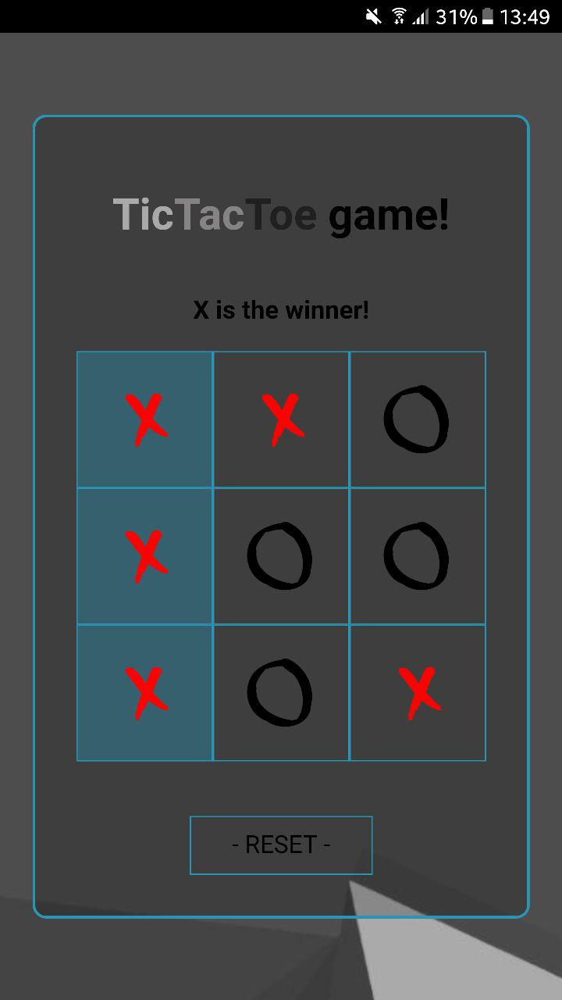
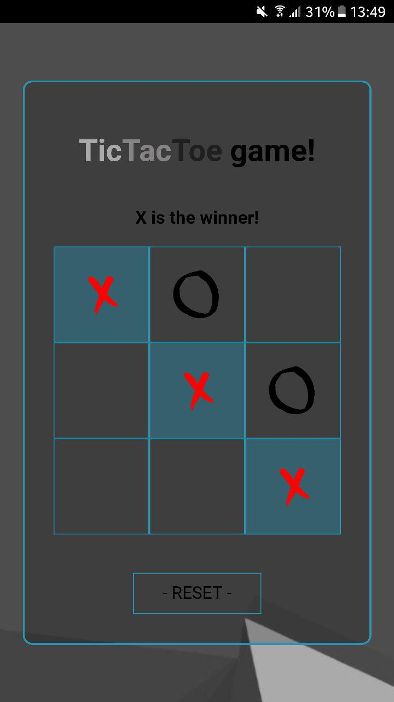

# Project Title

Tic-tac-toe React application


## First mobile screen


## Second mobile screen



## Getting Started

Follow these steps to get you started after cloning the repo:

```
npm install
```

and then

```
npm start
```

The app should start on a localhost server which you can access via other devices on the same IP adress


### Prerequisites

... will be installed with 

```
npm install
```


